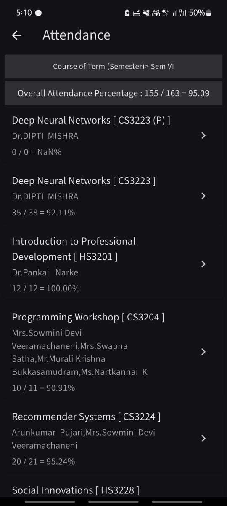

# 🎓 Campus Critics – Rate Your Professors


---
🌐 **Live Website**: [Campus_Critics](https://campus-critics-website.onrender.com)

---

[SRS](https://github.com/BHUVANA535/campus_critics_website/blob/main/Team13_SRS%20Document.pdf)

---
[SDS](https://github.com/BHUVANA535/campus_critics_website/blob/main/Project%20Software%20Design%20Specification.pdf)

---
[SoW](https://github.com/BHUVANA535/campus_critics_website/blob/main/Statement%20of%20Work%20(SOW)_CampusCritics.pdf)

---


**Campus Critics** is a student-driven platform to **rate professors**, **share course experiences**, and **engage with a peer community**. The platform ensures **authentic reviews** through OTP-based registration using university emails, empowering students to make smarter academic choices.

---


## Setup Instructions (Run Locally)

1. **Clone the repository**
   ```bash
   git clone https://github.com/yourusername/campus-critics.git
   cd campus-critics/end

2. **Install dependencies**

   ```bash
   pip install -r requirements.txt

3. **Run main.py**
      ```bash
      python main.py

## Registration : OTP Authentication

1. register with university email "xxxxxx@mahindrauniversity.edu.in"
2. otp will be sent to that email

## OCR: Only the user with attendance >=75% will allowed to rate/review the professor

To rate/review the professor you will be asked to upload the screenshot of attendance perecentage on juno app



##  Features

- 🔐 **OTP based Registration** using university email 
- 🔍 **Search professors** by name
- 🌟 Submit detailed **ratings** with feedback
- 📊 View professor pages with **weighted average scores**
- 🗣️ Post and comment in the **community forum** 

## Tech Stack

- **Backend**: Python (Flask)  
- **Frontend**: HTML, CSS, Javascript 
- **Database**: SQLite3
- **Authentication**: Email OTP via SMTP  
- **Environment Management**: python-dotenv  
